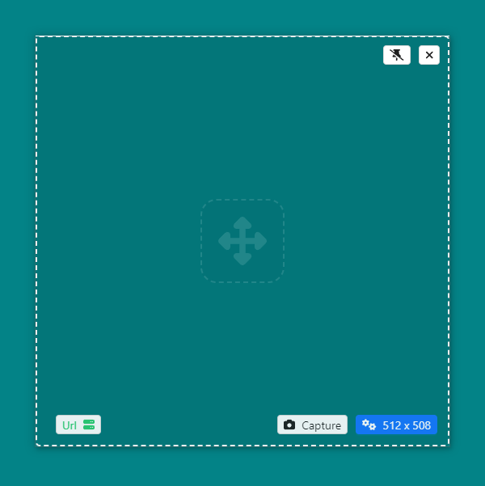
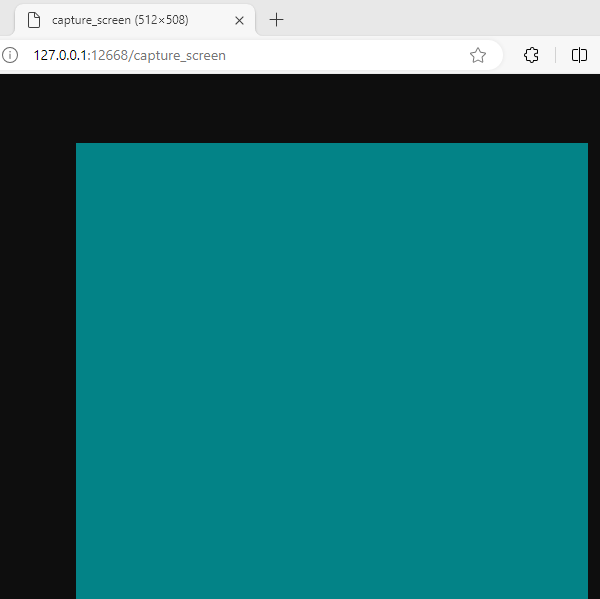

# Tommy's Comfy Screen Capturer

Tommy's Comfy Screen Capturer 是一个特定的截图工具

- **区域选择**：通过窗口捕获屏幕特定区域的画面。
- **本地 HTTP 服务**：该工具包含一个内置的本地 HTTP 服务，为其他软件（如 ComfyUI）提供一个 URL，以通过 HTTP 请求实时获取捕获的截图。
- **固定在屏幕特定区域** 可以通过图钉按钮进入固定状态，固定在特定区域并且不会阻挡鼠标点击，可以通过系统托盘菜单解锁





## 支持系统 / Supported System

1. Windows 10

## 许可证

本项目基于 [木兰协议 v2](https://license.coscl.org.cn/MulanPSL2) 进行许可。详情请参阅 [LICENSE](LICENSE) 文件。

## Dev / Build
- `pnpm i`

```
pnpm tauri dev
```

```
pnpm tauri build
```

---

# Tommy's Comfy Screen Capturer

Tommy's Comfy Screen Capturer is a specific screenshot tool.

- **Area Selection**: Capture specific areas of the screen through a window.
- **Local HTTP Service**: The tool includes a built-in local HTTP service that provides a URL for other software (such as ComfyUI) to fetch the captured screenshots via HTTP requests.
- **Pin to Specific Area**: You can pin the tool to a specific area of the screen using the pin button. It will stay in place without blocking mouse clicks and can be unlocked through the system tray menu.

## License

This project is licensed under the [Mulan PSL v2](https://license.coscl.org.cn/MulanPSL2). See the [LICENSE](LICENSE) file for details.